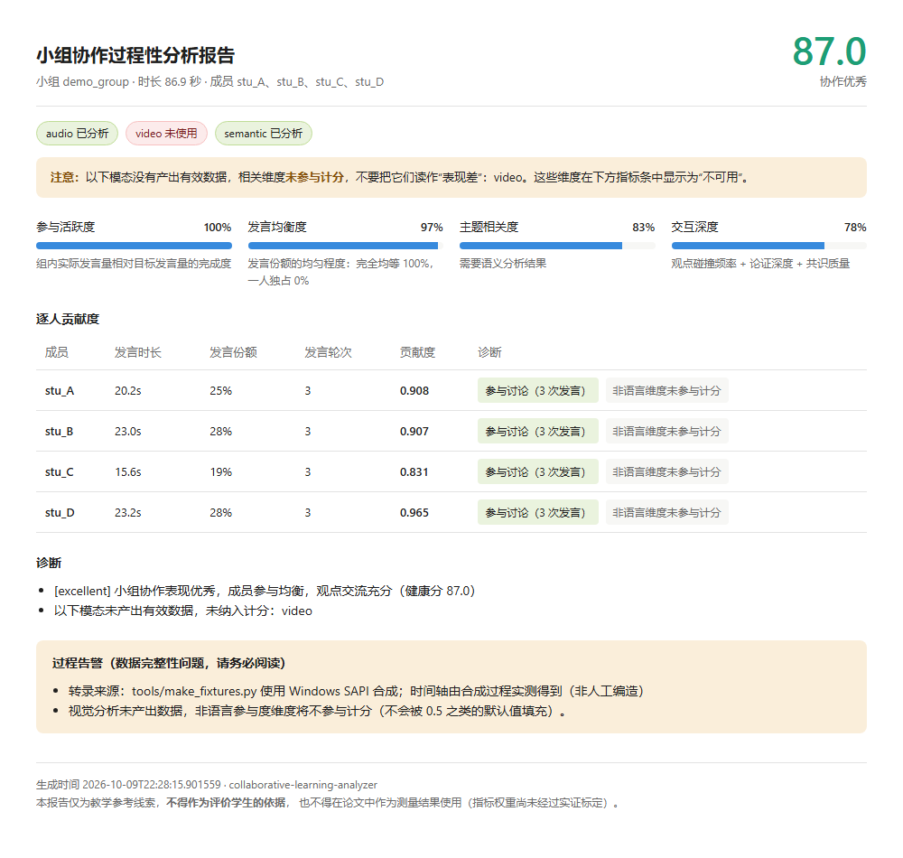

# Collaborative Learning Analyzer · 小组协作过程性分析

**状态：Alpha（1.1.0）。核心计分逻辑已重写并通过回归验证；
语音与视觉链路的精度尚未在真实课堂数据上评估。**

分析课堂小组讨论的音视频，输出参与度与协作质量的**过程性**指标，供教师参考。
设计上有一条明确的底线：**拿不到数据就说不出来，绝不编造数字。**

[](https://github.com/firstxcst/collaborative-learning-analyzer/actions/workflows/ci.yml)
[](https://www.python.org/)
[](LICENSE)
[](CHANGELOG.md)

[English README](README.md)



> 上图由 `cla demo` 用仓库自带的**合成**转录生成，走的是离线规则基线。
> 它演示的是输出格式与"不可用 ≠ 0"的行为，**不代表分析精度**。理由见「验证状态」。

---

## ⚠️ 用之前请先读这段

本工具目前是**教学参考工具与工程原型，不是测量工具**。
不得用它给学生打分，也不得把它的分数当作研究结果报告。

两条原因，直说：

1. 指标权重**没有经过实证标定**，也没有做过人机一致性检验（Cohen's Kappa / ICC）；
2. 语音与视觉链路的精度**从未在真实课堂录音上评估过**。

这两条都在「验证状态」里列为**未验证**。这一节是刻意保持诚实的——那正是它的价值所在。

---

## 目录

- [60 秒试一下](#60-秒试一下)
- [它做什么](#它做什么)
- [安装](#安装)
- [用法](#用法)
- [输出说明](#输出说明)
- [计分模型](#计分模型)
- [隐私与数据边界](#隐私与数据边界)
- [验证状态](#验证状态)
- [项目结构](#项目结构)
- [开发](#开发)
- [许可证](#许可证)

---

## 60 秒试一下

**不需要 API 密钥，不需要 `torch`，不需要 `opencv`。Windows / Linux / macOS 都能跑。**

```bash
git clone https://github.com/firstxcst/collaborative-learning-analyzer.git
cd collaborative-learning-analyzer
pip install -e .          # 核心包零第三方依赖
cla demo                  # 用仓库自带示例转录跑通完整流程
cla demo --html report.html   # 生成自包含 HTML 报告（无外链，可离线打开）
```

`cla demo` 用的是仓库内自带的合成转录与离线规则基线，用来验证流程与字段含义，
不是对真实学生的分析。

## 它做什么

| 模态 | 提取内容 | 依赖 |
|------|----------|------|
| **语音** | 谁在说话、说了什么、说多久（说话人分离 + ASR） | `[audio]` `[diarization]` |
| **语义** | 主题相关度、观点碰撞、论证深度、共识质量、**逐人**语义参与 | `[llm]` / `[qwen]`，或离线基线 |
| **视觉** | 相互关注、指点行为、小组凝聚度（姿态 + 追踪） | `[vision]` |

融合后输出 0–100 的协作健康分、五个等级、逐人贡献度与可执行诊断。

**成员身份如何确定。** 名册来自语音侧（真正说过话的人）。
视觉追踪 ID（`person_*`）**不会**被当作成员，除非你显式提供 `member_mapping`。
这是为了避免凭空造出"全程未发言"的幽灵成员。

---

## 安装

核心包**只依赖标准库**，安装不会拉取 torch（约 2 GB）。按需装 extra：

```bash
pip install -e .                 # 仅核心：计分、数据模型、CLI、离线规则基线
pip install -e ".[audio]"        # 语音：Whisper ASR + 音频探测
pip install -e ".[diarization]"  # 说话人分离（需 HuggingFace token）
pip install -e ".[voiceprint]"   # 声纹注册 / 身份对齐
pip install -e ".[vision]"       # 视觉：OpenCV + Ultralytics
pip install -e ".[llm]"          # 语义：任意 OpenAI 兼容接口
pip install -e ".[dev]"          # 开发：pytest / ruff / black / mypy
```

一次装齐（**体积很大**，含 torch）：`pip install -e ".[all]"`

配置放在项目根目录的 `.env`（由 `pyproject.toml` 定位），环境变量优先级更高。
用 `cla paths` 查看当前实际使用的目录。

---

## 用法

### 命令行

```bash
# 完整分析
export LLM_PROVIDER=openai          # 或 dashscope / vllm / heuristic
export OPENAI_API_KEY=sk-...
cla analyze --audio discussion.wav --video discussion.mp4 \
    --members 4 --topic "你们的讨论主题" --output report.json

# 离线、无密钥
cla analyze --transcript transcript.json --topic "波动, 散射, 大气" \
    --skip-video --output report.json

# 生成 HTML 报告
cla demo --html report.html
```

其他参数：`--align-profiles`（声纹身份对齐）、`--annotated-video out.mp4`、
`--skip-diarization`（跳过说话人分离，**会丧失个体区分能力**，报告中会明确标注）。

### 已有转录？

分会场麦克风、教师自带字幕、外部 ASR 结果都可以直接导入，跳过本地 ASR：

```json
{
  "source": "分会场麦克风",
  "topic_keywords": "波动, 散射, 大气",
  "segments": [
    {"speaker_id": "stu_A", "start": 0.0, "end": 3.2, "text": "……"}
  ]
}
```

### Python API

```python
from collaborative_learning_analyzer import analyze, render_report

report = analyze(
    audio_path="discussion.wav",
    video_path="discussion.mp4",
    topic="你们的讨论主题",
    group_id="group_3",
)
print(report.overall_health_score, report.health_level.value)
for c in report.individual_contributions:
    print(c.person_id, c.speaking_share, c.total_score, c.diagnosis["scored_dimensions"])

render_report(report, "report.html")
```

### 离线模式

`LLM_PROVIDER=heuristic` 使用基于话语标记词的规则基线。它**不是 LLM**，
也不声称具备 LLM 的语义理解能力。使用它时请把主题写成**逗号分隔的关键词列表**——
此时主题相关度等于"命中至少一个关键词的发言占比"。整句主题会被判为**不可用**，
而不是用字符重合度近似：那种粗糙代理一旦进入 0–100 的健康分，就是在冒充测量。

---

## 输出说明

```jsonc
{
  "group_id": "group_3",
  "total_duration": 88.2,
  "member_ids": ["stu_A", "stu_B", "stu_C", "stu_D"],

  "participation_activity": 1.0,     // 0-1  实际发言量 / 目标发言量
  "evenness": 0.86,                  // 0-1  发言份额的均匀程度
  "topic_relevance": 0.82,           // 0-1，不可用时为 null
  "interaction_depth": 0.71,         // 0-1，不可用时为 null
  "turn_taking_pattern": "balanced", // balanced / monopolizing / chaotic / unknown
  "consensus_quality": 0.66,         // 0-1，不可用时为 null
  "quality_score": 0.83,             // 0-1
  "overall_health_score": 83.2,      // 0-100
  "health_level": "good",            // critical / poor / fair / good / excellent

  "individual_contributions": [ /* 逐人：秒数、份额、轮次、四维分、总分、诊断 */ ],
  "diagnoses": ["..."],
  "suggestions": ["..."],

  "data_completeness": { "audio": true, "video": false, "semantic": true },
  "warnings": ["视觉分析未产出数据，非语言参与度维度将不参与计分（不会被 0.5 之类的默认值填充）。"]
}
```

### 三件必须知道的事

1. **缺失模态不会被编造。** 某个模态没产出数据时，它的维度**不参与计分**，
   权重在剩余维度上重新归一化，并在 `data_completeness` 与 `warnings` 中明确标出。
   绝不用 `0.5` 冒充"未知"。
2. **`null` 表示"不可用"，不是"0 分"。** `topic_relevance: null` 意味着没有有效的语义
   结果，而不是"这个组跑题了"。
3. **浮点按展示精度写出**（分数 1 位小数、比例 4 位小数）。
   `save → load` 不丢结构，浮点按该精度舍入。

---

## 计分模型

```
activity  = min(1, 组内发言总时长 / (总时长 × 目标发言占比))
evenness  = (1/HHI - 1) / (n - 1),  HHI = Σ pᵢ²,  pᵢ = 发言时长份额
depth     = 加权平均(观点碰撞速率, 论证深度, 共识质量)   # 缺失子项重新归一化
quality   = 加权平均(evenness, topic_relevance, depth)    # 缺失维度重新归一化
health    = 100 × activity × quality
```

`evenness` 的关键性质：份额完全均等 = 1，一人独占 = 0，**全员沉默 = 0**。

乘性活跃度门控使沉默组恒为 0 分。旧公式（`均衡度 = 1 − 2σ`）下，
全员沉默的小组得 **90.5 分（excellent）**——比正常均衡小组还高，
且 `critical` 等级在数学上不可达。

完整推导、与 v1.0.0 缺陷模型的对照、以及**权重尚未实证标定**的说明见
[`docs/SCORING_MODEL.md`](docs/SCORING_MODEL.md)。

---

## 隐私与数据边界

必须把两件事分开讲清楚（旧版文档在这里说得含糊到了不实）：

| 数据 | 是否离开本机 |
|------|--------------|
| 原始音频 / 视频 | **不离开**。ASR、说话人分离、姿态检测全部本地运行 |
| 对话**转录文本** | **会发送**给你配置的 LLM（默认 OpenAI）。这是语义分析的必要输入 |
| 聚合后的分数与诊断 | 保存在本地 `results/` |

因此：**如果你不能把学生对话文本发送给云端服务，请使用 `LLM_PROVIDER=vllm`
指向本地部署的模型，或使用 `LLM_PROVIDER=heuristic` 离线规则基线。**
转录包含学生真实对话内容，请按所在机构的科研伦理要求处理。

本工具目前**不提供**数据生命周期管理（加密存储、保留期限、自动删除）。
旧版文档曾承诺这些能力但没有实现，现改为如实说明。

使用前请取得学生及监护人的知情同意，并遵守所在机构的伦理审查要求。

---

## 验证状态

把"已验证"和"未验证"分开写，避免把未验证的东西讲成结论。

### 已验证

- **计分逻辑** —— 边界、单调性、五档可达性、缺失模态处理、往返无损，
  在 `tests/test_scoring.py` 中逐条断言
- **打包与导入** —— 安装后顶层包名、惰性导入、导入期无副作用、CLI 入口
- **代码卫生** —— 未使用导入、从未被引用的定义，由**自动化测试**持续检查
- **端到端** —— 在 `tools/make_fixtures.py` 生成的**真实媒体**上跑通全链路
- **测试有效性** —— 通过**变异测试**验证：11 处刻意注入的缺陷（含 v1.0.0 的全部缺陷）
  全部被检出。见 [`docs/MUTATION_TESTING.md`](docs/MUTATION_TESTING.md)

### 未验证（请勿假定有效）

- **Whisper 在中文课堂语音上的 ASR 准确率** —— 未在真实录音上评估
- **pyannote 在远场、重叠说话条件下的说话人分离准确率** —— 未评估
- **YOLO 人体检测与视线估计的准确性** —— 单目视线本身是困难问题，
  本实现是几何启发式，侧面机位与遮挡下误差会显著增大；**没有任何精度评估数据**
- **指标体系的构念效度** —— 权重未标定，未做人机一致性检验

要让它从"工程 demo"变成"研究工具"，还需要：真实课堂数据 → 双人独立人工编码 →
人机一致性分析 → 权重标定与信效度报告。

### 路线图

- [x] 计分模型重写与回归测试
- [x] 真实媒体夹具与端到端验证
- [ ] 真实课堂环境适配（远场、多机位、噪声）
- [ ] 与人工编码的一致性研究（效度证据）
- [ ] Web 可视化界面

---

## 项目结构

```
collaborative-learning-analyzer/
├── src/                          # 源码（安装后的顶层包名：collaborative_learning_analyzer）
│   ├── __init__.py               # 惰性导出（导入本包不会拉 cv2/torch）
│   ├── __main__.py               # python -m collaborative_learning_analyzer
│   ├── cli.py                    # cla 命令
│   ├── config.py                 # 配置与路径解析（导入期无副作用）
│   ├── data_models.py            # 数据模型与 JSON 往返
│   ├── audio_agent.py            # 语音：分离 / ASR / 声纹对齐 / 转录导入
│   ├── video_agent.py            # 视觉：姿态 / 追踪 / 交互判定
│   ├── semantic_agent.py         # 语义：LLM 分窗分析 + 离线规则基线
│   ├── fusion_engine.py          # 融合计分
│   ├── pipeline.py               # 端到端编排
│   ├── render.py                 # 自包含 HTML 报告
│   └── py.typed                  # PEP 561 类型标记
├── tests/                        # 测试（见「验证状态」）
├── tools/make_fixtures.py        # 真实媒体夹具生成
├── tools/mutation_check.py       # 变异测试工具
├── tools/synth_tts.ps1           # Windows SAPI 语音合成
├── examples/                     # 两个可运行示例
├── docs/                         # 计分模型、审计修复对照、变异测试结果
├── fixtures/                     # 生成物（媒体不入库，说明见 fixtures/README.md）
├── pyproject.toml                # 唯一的依赖与打包配置来源
├── CHANGELOG.md
├── CONTRIBUTING.md
└── LICENSE                       # AGPL-3.0 全文
```

---

## 开发

```bash
pip install -e ".[all,dev]"

pytest                       # 全部测试
pytest -m "not slow"         # 跳过需要夹具的慢测试
python tools/mutation_check.py   # 确认测试仍能检出被注入的缺陷
ruff check src tests
black src tests && isort src tests
```

提交前请确保 `pytest` 全绿。新增计分逻辑必须同时补一条**会失败的**断言 ——
本项目用变异测试验证测试有效性（`docs/MUTATION_TESTING.md`）。

---

## 许可证

**GNU Affero General Public License v3.0 or later (AGPL-3.0-or-later)**，
全文见 [LICENSE](LICENSE)。

AGPL 的核心约束：如果你把本软件（含修改版）作为网络服务提供给他人使用，
**必须**向他们提供对应源码。若你的使用场景无法接受这一条，请不要使用本软件。

> 说明：本仓库此前的文档对许可证有四种互相矛盾的说法（README 徽章写 MIT、正文写 AGPL、
> `LICENSE` 是一份自写摘要、`CONTRIBUTING.md` 又写 MIT）。现已统一为 AGPL-3.0-or-later，
> 并换用 GNU 官方全文。
